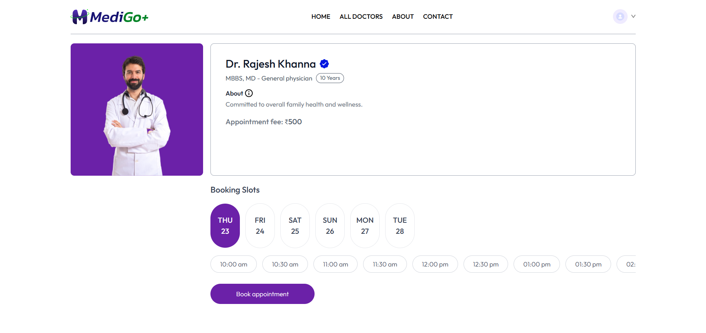

# MEDIGO – Full‑Stack Doctor Appointment Platform

A production‑ready MERN stack application with three apps in one repository:

- **Frontend (Patient)** – React + Vite + Tailwind
- **Admin Panel** – React + Vite + Tailwind
- **Backend API** – Node.js (Express 5) + MongoDB (Mongoose)

Book appointments by speciality, manage profiles, and handle clinic operations across **User / Doctor / Admin** roles.

---

## 🚀 Live Demo

| Platform        | URL |
|----------------|-----|
| 🌐 **Frontend (Patient App)** | https://medigo-frontend.onrender.com/ |
| 🛠️ **Admin Panel** | https://medigo-admin.onrender.com/admin-dashboard |

---

## ✨ Features

### Patient (Frontend)
- Email/password auth (JWT based)
- Browse doctors by speciality and search
- Doctor detail page with available slots
- Book / view / cancel appointments
- Profile management with avatar upload (Cloudinary)
- Toast notifications

### Doctor (Admin app – doctor views)
- Secure login
- Dashboard with today/weekly metrics
- Appointments list: **complete / cancel**
- Toggle **availability**
- Edit profile

### Super Admin (Admin app – admin views)
- Login with configured admin credentials
- Add new doctors (with image, degree, fees, address, etc.)
- List / search doctors, toggle availability
- View clinic‑wide appointments
- Cancel appointments
- Overview dashboard (patients, doctors, earnings, recent activity)

### Backend
- REST API with **Express 5**
- MongoDB models for **users, doctors, appointments**
- Auth middlewares for **user / doctor / admin**
- Image upload with **multer → Cloudinary**
- (Optional) **Razorpay** payment integration (scaffolded)
- CORS + JSON body parsing

---

## 🗂️ Monorepo Structure

```
MEDIGO/
├─ admin/                 # React + Vite admin panel
│  ├─ src/
│  │  ├─ pages/Admin/*    # Admin pages (AddDoctor, Dashboard, DoctorsList, Appointments)
│  │  ├─ pages/Doctor/*   # Doctor pages (Dashboard, Appointments, Profile)
│  │  ├─ components/*     # Navbar, Sidebar
│  │  └─ contexts/*       # AdminContext, DoctorContext, AppContext
│  └─ package.json
├─ frontend/              # React + Vite patient app
│  ├─ src/
│  │  ├─ pages/*          # Home, Doctors, Appointment, MyAppointments, MyProfile, Login, etc.
│  │  ├─ components/*     # Header, Navbar, Banner, TopDoctors, SpecialityMenu, Footer
│  │  └─ context/*        # AppContext
│  └─ package.json
└─ backend/               # Node/Express API
   ├─ server.js
   ├─ config/             # mongodb.js, cloudinary.js
   ├─ models/             # userModel.js, doctorModel.js, appointmentModel.js
   ├─ controllers/        # userController.js, doctorController.js, adminController.js
   ├─ middlewares/        # authUser.js, authDoctor.js, authAdmin.js, multer.js
   └─ routes/             # userRoute.js, doctorRoute.js, adminRoute.js
```

---

## ⚙️ Tech Stack

- **Frontend/Admin:** React **19**, React Router **7**, Vite **6**, Tailwind CSS **4**, Axios, React‑Toastify
- **Backend:** Node.js, **Express 5**, Mongoose, JWT, bcrypt, Multer, Cloudinary SDK, CORS, dotenv
- **Payments (optional):** Razorpay
- **DB:** MongoDB (Atlas or local)

---


## 🖼️ Screenshots

### 🏠 Home Page


### 🩺 All Doctors Page


### 📅 Booking Page


---

## 🚀 Quick Start (Development)

> **Prereqs:** Node.js ≥ 18 (recommend 20 LTS), npm, a MongoDB URI, and a Cloudinary account.

### 1) Backend API
```bash
cd backend
npm install
```

Create `backend/.env`:
```ini
PORT=5000
MONGODB_URI=mongodb://localhost:27017           # or your Atlas URI (without /medigo)
JWT_SECRET=your_jwt_secret

# Cloudinary (required for image uploads)
CLOUDINARY_NAME=xxx
CLOUDINARY_API_KEY=xxx
CLOUDINARY_SECRET_KEY=xxx

# Admin login (for /api/admin/login)
ADMIN_EMAIL=admin@example.com
ADMIN_PASSWORD=strongpassword

# Payments (optional – only if you wire Razorpay route)
RAZORPAY_KEY_ID=your_key_id
RAZORPAY_KEY_SECRET=your_key_secret
CURRENCY=INR
```

Run the API:
```bash
npm run server   # uses nodemon
# or
npm start        # plain node server.js
```

### 2) Patient Frontend
```bash
cd ../frontend
npm install
```

Create `frontend/.env`:
```ini
VITE_BACKEND_URL=http://localhost:5000
```

Start dev server:
```bash
npm run dev
```

### 3) Admin Panel
```bash
cd ../admin
npm install
```

Create `admin/.env`:
```ini
VITE_BACKEND_URL=http://localhost:5000
```

Start dev server:
```bash
npm run dev
```

> Vite runs on **5173** by default. If both apps are open, one may use **5174**.

---

## 🔐 Authentication

- **JWT** tokens are issued on login and stored client‑side.
- Separate middlewares:
  - `authUser` → protects patient routes
  - `authDoctor` → protects doctor routes
  - `authAdmin` → protects admin routes

---

## 🧭 API Overview

> Base URL: `{{BACKEND_URL}}` (e.g., `http://localhost:5000`)

### Public / Auth
- **POST** `/api/user/register` – create user  
- **POST** `/api/user/login` – login user  
- **POST** `/api/doctor/login` – login doctor  
- **POST** `/api/admin/login` – login admin

### Patient
- **GET** `/api/user/get-profile` *(auth: user)*
- **POST** `/api/user/update-profile` *(auth: user, multipart form with `image`)*  
- **POST** `/api/user/book-appointment` *(auth: user)*
- **GET** `/api/user/appointments` *(auth: user)*
- **POST** `/api/user/cancel-appointment` *(auth: user)*
<!-- - POST `/api/user/payment-razorpay` *(auth: user)* → scaffolded -->

### Doctor
- **GET** `/api/doctor/list` – list doctors (used on patient side)
- **GET** `/api/doctor/appointments` *(auth: doctor)*
- **POST** `/api/doctor/complete-appointment` *(auth: doctor)*
- **POST** `/api/doctor/cancel-appointment` *(auth: doctor)*
- **GET** `/api/doctor/dashboard` *(auth: doctor)*
- **GET** `/api/doctor/profile` *(auth: doctor)*
- **POST** `/api/doctor/update-profile` *(auth: doctor)*

### Admin
- **POST** `/api/admin/add-doctor` *(auth: admin, multipart form with `image`)*
- **POST** `/api/admin/all-doctors` *(auth: admin)*
- **POST** `/api/admin/change-availability` *(auth: admin or doctor)*
- **GET** `/api/admin/appointments` *(auth: admin)*
- **POST** `/api/admin/cancel-appointment` *(auth: admin)*
- **GET** `/api/admin/dashboard` *(auth: admin)*

> See `backend/controllers/*` for exact payloads and responses.

---

## 📸 Images & Uploads

- Image uploads use **multer** in the API and are stored on **Cloudinary**.
- For doctor creation and profile updates, send `multipart/form-data` with the file in `image`.

---

## 💳 Payments (Optional)

Razorpay integration is scaffolded in `userController.js`.  
Uncomment the route in `userRoute.js`, supply `RAZORPAY_*` keys in `.env`, and implement the client‑side checkout call.

---

## 🧪 Linting & Scripts

Each React app ships with ESLint and Tailwind 4. Useful scripts:

```bash
# frontend / admin
npm run dev
npm run build
npm run preview
npm run lint

# backend
npm run server   # nodemon
npm start
```

---

## 📝 Notes & Gotchas

- Ensure `VITE_BACKEND_URL` points to the same origin as the API (including port).
- If you deploy, configure **CORS** on the API to allow your deployed frontend/admin origins.
- Express 5 is used – middleware and error‑handling syntax differs slightly from Express 4.

---


## 🙌 Acknowledgements

Built with ❤️ using React, Vite, Tailwind, Node, and MongoDB.  

